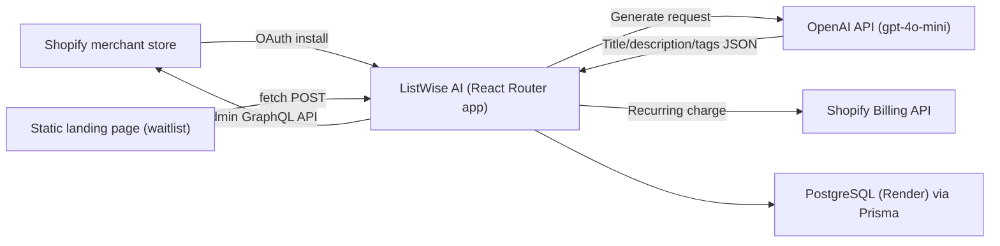

# ListWise AI — Technical Handoff

For a developer picking this up. Explains what this is, how it works, what's deployed where, and what's left to do.

## 1. What this is (business context)

**ListWise AI** is a Shopify app. A merchant installs it on their Shopify store; it reads their product catalog, sends product info to OpenAI, and generates an SEO-optimized title, description, meta description, and tags. The merchant reviews a before/after comparison and clicks "Apply" to push the new content back to their store via the Shopify Admin GraphQL API.

**Monetization:** subscription billing, handled entirely by Shopify's Billing API (not Stripe/PayPal):
- Free: 20 lifetime AI generations, enforced in-app (no Shopify billing involved).
- Starter: $9.99/mo, 200 generations/month.
- Growth: $29.99/mo, unlimited generations.

Distribution channel is the Shopify App Store (not yet submitted — see Section 6).

## 2. Architecture



## 3. Tech stack

- **Framework:** React Router v7 (formerly Remix), using Shopify's official `@shopify/shopify-app-react-router` package for OAuth, session storage, and billing.
- **UI:** Shopify Polaris web components (`<s-page>`, `<s-button>`, etc. — global custom elements provided by App Bridge, typed via `@shopify/polaris-types`). Not the older `@shopify/polaris` React component library.
- **DB/ORM:** Prisma. Two schema files:
  - `prisma/schema.prisma` — SQLite, used for local dev.
  - `prisma/schema.production.prisma` — PostgreSQL, used in production.
  - `scripts/prepare-db.mjs` picks the right one automatically based on whether `DATABASE_URL` starts with `postgres`.
- **AI:** OpenAI Node SDK (`openai` package), model `gpt-4o-mini` by default (configurable via `OPENAI_MODEL` env var).
- **Hosting:** Render.com — one Docker-based Web Service (the app) + one Static Site (the marketing landing page) + one free PostgreSQL instance, all in the same Render workspace.

## 4. Directory structure (inside `listwise-ai/`)

```
app/
  lib/
    plans.ts            # Plan/pricing constants shared by server + UI
    openai.server.ts    # OpenAI integration — builds the prompt, calls the API, parses JSON response
    usage.server.ts     # Per-shop usage tracking + free-tier/plan limit enforcement
  routes/
    app._index.tsx       # Main screen: product picker, generate, before/after review, apply
    app.settings.tsx     # Brand voice (tone) preference
    app.billing.tsx      # Plan selection UI + Shopify Billing API integration
    api.waitlist.tsx     # Public (CORS-open) endpoint used by the landing page to collect emails
    app.tsx, _index/, auth.*, webhooks.*   # Boilerplate from Shopify's official template
  shopify.server.ts      # Shopify app config: API keys, scopes, billing plans
  db.server.ts           # Prisma client singleton
prisma/
  schema.prisma            # SQLite (dev)
  schema.production.prisma # PostgreSQL (prod)
  migrations/               # SQLite migration history (dev only; prod uses `prisma db push`)
scripts/
  prepare-db.mjs   # Environment-aware DB setup, run on container start
landing/
  index.html       # Marketing/waitlist static site (deployed as its own Render Static Site)
shopify.app.toml    # Shopify app config (scopes, webhooks, redirect URLs) — synced via Shopify CLI
render.yaml          # Render Blueprint spec (reference; actual services were created via Render API, see Section 5)
Dockerfile
```

## 5. What's deployed, where, and how

| What | Where | Notes |
|---|---|---|
| App (Web Service) | `https://listwise-ai.onrender.com` | Render service `srv-d9evlvrtqb8s73banlag`. Docker build from repo root `Dockerfile`. |
| Landing page (Static Site) | `https://listwise-ai-landing.onrender.com` | Render service `srv-d9f062741pts73fon2r0`. Root dir `landing/`, no build step. |
| Database | Render PostgreSQL, internal host `dpg-d9evlimrnols73f3nek0-a` | **Free tier — expires ~30 days after creation (created 2026-07-20, expires ~2026-08-19). Must upgrade to a paid plan before then or data will be lost.** |
| Source | `https://github.com/elior2oscar-dot/ListWise-AI` | Single repo, `main` branch. Contains both the app and the landing page (`landing/` subfolder). |
| Shopify app registration | Dev Dashboard org "ListWise AI" | Client ID `b39c7d26b9b5d71c98f3c65401f56bad`. |

**Important:** Auto-deploy-on-push is *not* currently wired up (the Render services were created via direct API calls referencing the GitHub repo URL, not through Render's GitHub App OAuth flow, so push webhooks aren't registered). After pushing new commits, you must manually trigger a deploy:

```bash
curl -X POST "https://api.render.com/v1/services/<serviceId>/deploys" \
  -H "Authorization: Bearer $RENDER_API_KEY" -H "Content-Type: application/json" -d "{}"
```

Or connect the repo through the Render dashboard UI (Settings → connect GitHub App) to enable auto-deploy properly.

### Environment variables (set directly on the Render web service, not committed anywhere)

```
NODE_ENV=production
SHOPIFY_API_KEY=b39c7d26b9b5d71c98f3c65401f56bad
SHOPIFY_API_SECRET=<see Render dashboard — Shopify app client secret>
SCOPES=read_products,write_products
SHOPIFY_APP_URL=https://listwise-ai.onrender.com
OPENAI_API_KEY=<see Render dashboard>
OPENAI_MODEL=gpt-4o-mini
DATABASE_URL=<internal Postgres connection string, see Render dashboard>
```

For local development, copy `.env.example` to `.env` and fill in the same values (use the SQLite `DATABASE_URL="file:dev.sqlite"` locally instead of Postgres).

## 6. What's NOT done yet

1. **Not submitted to the Shopify App Store.** The app is only installed on a personal dev store (`listwise-test.myshopify.com`) for testing — confirmed working end-to-end (OAuth install, Admin API access, product fetch all verified via `shopify app execute`). Public availability requires: real screenshots of the working UI, a hosted privacy policy, and manually submitting through the Dev Dashboard's "Distribution" tab. Draft listing copy is in `marketing/app-store-listing.md`.
2. **Landing page is in "waitlist" mode**, not a live install funnel — because there's no public App Store listing to link to yet. The email capture (`/api/waitlist` → `WaitlistEntry` table) works and is verified live.
3. **Auto-deploy on git push is not configured** (see above) — deploys must be triggered manually via the Render API or by connecting the GitHub App through the dashboard.
4. **Free Postgres expires in ~30 days from 2026-07-20.** Upgrade the database plan on Render before then.
5. No automated tests exist. `npm run typecheck` and `npm run build` both pass and are the current quality gate.
6. Marketing content drafts (Reddit/Product Hunt/Indie Hackers posts) are in `marketing/community-posts.md`, written but not yet posted — intentionally left for the founder to post from their own accounts.

## 7. Running locally

```bash
cd listwise-ai
npm install
cp .env.example .env   # fill in SHOPIFY_API_KEY, SHOPIFY_API_SECRET, OPENAI_API_KEY
npx prisma migrate dev
npm run dev             # uses Shopify CLI, opens a tunnel, connects to a dev store
```

`npm run config:link` re-links `shopify.app.toml` to the Shopify app if needed (requires Shopify CLI login — device-code flow prints a URL + code).

## 8. Quick sanity checklist for a new developer

- [ ] `npm run typecheck` passes
- [ ] `npm run build` passes
- [ ] `GET https://listwise-ai.onrender.com/` returns 200
- [ ] `GET https://listwise-ai-landing.onrender.com/` returns 200
- [ ] `POST https://listwise-ai.onrender.com/api/waitlist` with `{"email":"..."}` returns `{"success":true}`
